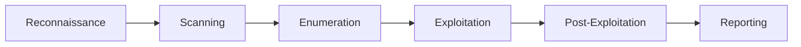

# Guardian Shield — Penetration Testing Specification
## Crypto Hound LLC — Quantum-Grade Red Team Scenarios

---

## 1. Overview

This document specifies penetration testing requirements for Guardian Shield, including quantum-grade attack scenarios designed to validate the security posture of the fraud defense orchestration suite.

---

## 2. Testing Scope

### 2.1 In-Scope Systems

| System | Type | Environment |
|--------|------|-------------|
| Shield Orchestrator | Kubernetes Deployment | Production-like |
| Fraud Monitor Agent | Kubernetes Deployment | Production-like |
| Evidence Collector | Kubernetes Deployment | Production-like |
| Regulator Portal | Web Application | Production-like |
| Evidence Ledger API | REST API | Production-like |
| Grafana Dashboards | Monitoring UI | Production-like |
| Database (PostgreSQL) | Data Store | Production-like |
| Message Queue (RabbitMQ) | Message Broker | Production-like |

### 2.2 Out-of-Scope

- Production environments (testing in staging only)
- Third-party services (cloud provider infrastructure)
- Denial of Service testing (coordinated separately)
- Social engineering (separate engagement)

---

## 3. Testing Methodology

### 3.1 Standards Compliance

| Standard | Description |
|----------|-------------|
| OWASP Testing Guide v4.2 | Web application testing |
| PTES | Penetration Testing Execution Standard |
| NIST SP 800-115 | Technical Guide to Information Security Testing |
| OSSTMM | Open Source Security Testing Methodology |

### 3.2 Testing Phases



---

## 4. Attack Scenarios

### 4.1 Authentication Attacks

#### Scenario A1: Credential Stuffing
```yaml
scenario:
  id: "A1"
  name: "Credential Stuffing Attack"
  objective: "Test rate limiting and account lockout"
  severity: "High"
  
  attack_vectors:
    - method: "automated_login_attempts"
      target: "/api/auth/login"
      payload: "leaked_credential_database"
      rate: "100 requests/second"
      
  expected_controls:
    - "Rate limiting (max 10 attempts/minute)"
    - "Account lockout after 5 failures"
    - "CAPTCHA challenge"
    - "IP blocking"
    
  success_criteria:
    - "No valid credentials obtained"
    - "Alerts triggered in SIEM"
    - "Automated blocking engaged"
```

#### Scenario A2: JWT Token Manipulation
```yaml
scenario:
  id: "A2"
  name: "JWT Token Manipulation"
  objective: "Test JWT signature validation"
  severity: "Critical"
  
  attack_vectors:
    - method: "algorithm_confusion"
      technique: "Change RS256 to HS256"
    - method: "null_signature"
      technique: "Remove signature, set alg=none"
    - method: "key_injection"
      technique: "Inject public key in jwk header"
    - method: "token_replay"
      technique: "Reuse expired tokens"
      
  expected_controls:
    - "Strict algorithm validation"
    - "Signature verification"
    - "Token expiry enforcement"
    - "Token revocation check"
```

#### Scenario A3: MFA Bypass
```yaml
scenario:
  id: "A3"
  name: "Multi-Factor Authentication Bypass"
  objective: "Test MFA implementation robustness"
  severity: "Critical"
  
  attack_vectors:
    - method: "totp_brute_force"
      description: "Brute force 6-digit TOTP codes"
    - method: "session_fixation"
      description: "Bypass MFA via pre-authenticated session"
    - method: "backup_code_enumeration"
      description: "Enumerate backup codes"
    - method: "mfa_downgrade"
      description: "Force fallback to weaker auth"
      
  expected_controls:
    - "TOTP attempt limiting"
    - "Session binding"
    - "Backup code rate limiting"
    - "No MFA downgrade path"
```

### 4.2 Authorization Attacks

#### Scenario B1: Privilege Escalation
```yaml
scenario:
  id: "B1"
  name: "Horizontal/Vertical Privilege Escalation"
  objective: "Test RBAC enforcement"
  severity: "Critical"
  
  attack_vectors:
    - method: "idor"
      target: "/api/ledger/entries/{id}"
      technique: "Access other users' evidence"
    - method: "role_manipulation"
      target: "/api/users/profile"
      technique: "Modify role in request"
    - method: "forced_browsing"
      target: "/admin/*"
      technique: "Access admin endpoints as viewer"
      
  expected_controls:
    - "Server-side authorization checks"
    - "Object-level access control"
    - "Role validation on each request"
```

#### Scenario B2: API Authorization Bypass
```yaml
scenario:
  id: "B2"
  name: "API Authorization Bypass"
  objective: "Test API access controls"
  severity: "High"
  
  attack_vectors:
    - method: "parameter_tampering"
      technique: "Modify user_id in requests"
    - method: "http_method_override"
      technique: "Use X-HTTP-Method-Override"
    - method: "graphql_introspection"
      technique: "Explore unauthorized queries"
    - method: "mass_assignment"
      technique: "Add admin fields to requests"
```

### 4.3 Data Security Attacks

#### Scenario C1: Evidence Ledger Tampering
```yaml
scenario:
  id: "C1"
  name: "Evidence Ledger Integrity Attack"
  objective: "Test append-only ledger integrity"
  severity: "Critical"
  
  attack_vectors:
    - method: "direct_database_access"
      technique: "Attempt UPDATE/DELETE on ledger"
    - method: "api_manipulation"
      technique: "Send crafted PUT/DELETE requests"
    - method: "hash_collision"
      technique: "Attempt hash collision for evidence"
    - method: "signature_forgery"
      technique: "Forge GPG signature"
      
  expected_controls:
    - "Database triggers preventing modification"
    - "API rejecting mutation requests"
    - "Hash chain validation"
    - "Signature verification"
```

#### Scenario C2: Data Exfiltration
```yaml
scenario:
  id: "C2"
  name: "Sensitive Data Exfiltration"
  objective: "Test data loss prevention"
  severity: "Critical"
  
  attack_vectors:
    - method: "sql_injection"
      target: "Search parameters"
      payload: "UNION SELECT queries"
    - method: "xxe"
      target: "XML import endpoints"
      payload: "External entity injection"
    - method: "ssrf"
      target: "URL parameters"
      payload: "Internal service access"
    - method: "bulk_export"
      target: "/api/ledger/export"
      technique: "Unauthorized bulk data export"
      
  expected_controls:
    - "Parameterized queries"
    - "XML parser hardening"
    - "SSRF protections"
    - "Export rate limiting and audit"
```

### 4.4 Cryptographic Attacks

#### Scenario D1: Quantum-Ready Cryptography Testing
```yaml
scenario:
  id: "D1"
  name: "Quantum-Grade Cryptographic Assessment"
  objective: "Validate quantum-resistant preparations"
  severity: "High"
  
  attack_vectors:
    - method: "classical_key_recovery"
      technique: "Attempt RSA key factorization"
      note: "Verify 4096-bit keys are in use"
    - method: "side_channel_analysis"
      technique: "Timing attacks on crypto operations"
    - method: "weak_random"
      technique: "Analyze RNG entropy sources"
    - method: "key_reuse_detection"
      technique: "Identify key reuse patterns"
      
  expected_controls:
    - "RSA-4096 or Ed25519 in use"
    - "Constant-time crypto implementations"
    - "Hardware RNG or CSPRNG"
    - "Key rotation enforcement"
    
  quantum_preparation_checks:
    - "Hybrid signature support ready"
    - "Post-quantum algorithm integration path"
    - "Key agility (ability to swap algorithms)"
```

#### Scenario D2: Blockchain Anchor Verification
```yaml
scenario:
  id: "D2"
  name: "Blockchain Anchor Integrity"
  objective: "Verify anchor immutability"
  severity: "High"
  
  attack_vectors:
    - method: "fake_anchor"
      technique: "Submit evidence with invalid anchor"
    - method: "anchor_replay"
      technique: "Reuse anchor transaction for different evidence"
    - method: "anchor_timing"
      technique: "Manipulate anchor timestamps"
      
  expected_controls:
    - "Anchor transaction verification"
    - "Hash binding to specific evidence"
    - "Timestamp validation"
```

### 4.5 Infrastructure Attacks

#### Scenario E1: Container Escape
```yaml
scenario:
  id: "E1"
  name: "Container Escape Attempt"
  objective: "Test container isolation"
  severity: "Critical"
  
  attack_vectors:
    - method: "privileged_container"
      technique: "Exploit if running as privileged"
    - method: "kernel_exploit"
      technique: "CVE-based container escape"
    - method: "mount_abuse"
      technique: "Access host filesystem via mounts"
    - method: "capability_abuse"
      technique: "Exploit excessive capabilities"
      
  expected_controls:
    - "Non-privileged containers"
    - "Patched kernel"
    - "Minimal mounts"
    - "Dropped capabilities"
```

#### Scenario E2: Kubernetes Cluster Attack
```yaml
scenario:
  id: "E2"
  name: "Kubernetes Cluster Compromise"
  objective: "Test K8s security posture"
  severity: "Critical"
  
  attack_vectors:
    - method: "service_account_abuse"
      technique: "Use default SA tokens"
    - method: "etcd_access"
      technique: "Direct etcd access if exposed"
    - method: "kubelet_api"
      technique: "Access unauthenticated kubelet"
    - method: "secrets_extraction"
      technique: "Read secrets from pods"
      
  expected_controls:
    - "Restricted service accounts"
    - "etcd encryption and auth"
    - "Kubelet authentication"
    - "External secrets management"
```

### 4.6 Application Attacks

#### Scenario F1: Web Application Vulnerabilities
```yaml
scenario:
  id: "F1"
  name: "OWASP Top 10 Assessment"
  objective: "Test for common web vulnerabilities"
  severity: "High"
  
  vulnerabilities:
    - category: "A01:2021 Broken Access Control"
      tests:
        - "IDOR testing"
        - "Privilege escalation"
        - "CORS misconfiguration"
        
    - category: "A02:2021 Cryptographic Failures"
      tests:
        - "Weak TLS configuration"
        - "Sensitive data exposure"
        - "Insufficient encryption"
        
    - category: "A03:2021 Injection"
      tests:
        - "SQL injection"
        - "NoSQL injection"
        - "Command injection"
        - "LDAP injection"
        
    - category: "A07:2021 Identification and Authentication Failures"
      tests:
        - "Session management"
        - "Credential recovery"
        - "Password policy"
```

#### Scenario F2: API Security Assessment
```yaml
scenario:
  id: "F2"
  name: "API Security Testing"
  objective: "Test REST API security"
  severity: "High"
  
  tests:
    - category: "Authentication"
      items:
        - "Bearer token validation"
        - "API key security"
        - "OAuth implementation"
        
    - category: "Input Validation"
      items:
        - "Parameter fuzzing"
        - "Type coercion"
        - "Boundary testing"
        
    - category: "Rate Limiting"
      items:
        - "Request throttling"
        - "Resource exhaustion"
        - "Batch endpoint abuse"
        
    - category: "Error Handling"
      items:
        - "Stack trace exposure"
        - "Verbose error messages"
        - "Debug endpoints"
```

---

## 5. Testing Schedule

### 5.1 Regular Testing

| Test Type | Frequency | Duration | Vendor |
|-----------|-----------|----------|--------|
| Automated Vulnerability Scan | Weekly | 4 hours | Internal |
| Web Application Pentest | Quarterly | 5 days | External |
| API Security Assessment | Quarterly | 3 days | External |
| Infrastructure Pentest | Bi-annually | 5 days | External |
| Red Team Exercise | Annually | 10 days | External |

### 5.2 Event-Triggered Testing

- After major releases
- After infrastructure changes
- After security incidents
- After architecture changes

---

## 6. Rules of Engagement

### 6.1 Authorization

```yaml
authorization:
  document: "Signed penetration testing agreement"
  scope_definition: "Explicit system list"
  testing_window: "Defined schedule"
  emergency_contacts:
    - role: "Security Lead"
      phone: "+1-XXX-XXX-XXXX"
    - role: "Infrastructure Lead"
      phone: "+1-XXX-XXX-XXXX"
```

### 6.2 Boundaries

```yaml
boundaries:
  allowed:
    - "All testing techniques on in-scope systems"
    - "Social engineering (with prior approval)"
    - "Physical security (with prior approval)"
    
  prohibited:
    - "Testing production systems"
    - "Destructive attacks"
    - "Attacking out-of-scope systems"
    - "Exfiltrating real user data"
    - "Interrupting business operations"
```

### 6.3 Data Handling

```yaml
data_handling:
  evidence_retention: "90 days post-engagement"
  encryption_required: true
  secure_deletion: "After retention period"
  pii_handling: "Anonymize in reports"
```

---

## 7. Reporting Requirements

### 7.1 Report Structure

```markdown
1. Executive Summary
   - Overall risk rating
   - Key findings summary
   - Remediation priorities

2. Methodology
   - Testing approach
   - Tools used
   - Scope confirmation

3. Findings
   - For each finding:
     - Severity rating (CVSS)
     - Description
     - Evidence
     - Impact
     - Remediation
     - References

4. Technical Appendix
   - Detailed evidence
   - Tool output
   - Traffic captures
```

### 7.2 Severity Classification

| Severity | CVSS Score | Example |
|----------|------------|---------|
| Critical | 9.0 - 10.0 | Remote code execution |
| High | 7.0 - 8.9 | Authentication bypass |
| Medium | 4.0 - 6.9 | Information disclosure |
| Low | 0.1 - 3.9 | Missing security headers |
| Informational | 0.0 | Best practice recommendations |

---

## 8. Remediation SLAs

| Severity | Remediation Deadline | Verification |
|----------|---------------------|--------------|
| Critical | 24 hours | Immediate retest |
| High | 7 days | Retest within 14 days |
| Medium | 30 days | Retest next quarter |
| Low | 90 days | Verify next pentest |

---

## 9. Tools and Techniques

### 9.1 Approved Tools

```yaml
tools:
  reconnaissance:
    - "Nmap"
    - "Masscan"
    - "Amass"
    - "Shodan"
    
  web_application:
    - "Burp Suite Pro"
    - "OWASP ZAP"
    - "Nuclei"
    - "SQLMap"
    
  api_testing:
    - "Postman"
    - "GraphQL Voyager"
    - "Arjun"
    
  infrastructure:
    - "Metasploit"
    - "Cobalt Strike"
    - "BloodHound"
    
  container:
    - "Trivy"
    - "kube-hunter"
    - "Falco"
```

### 9.2 Custom Tooling

```yaml
custom_tools:
  guardian_shield_specific:
    - name: "ledger_integrity_checker"
      purpose: "Validate hash chain integrity"
    - name: "anchor_verifier"
      purpose: "Verify blockchain anchors"
    - name: "evidence_tamper_detector"
      purpose: "Detect evidence modification attempts"
```

---

## 10. Appendix: Checklist

- [ ] Signed penetration testing agreement
- [ ] Scope confirmed in writing
- [ ] Testing environment prepared
- [ ] Emergency contacts verified
- [ ] Data handling procedures agreed
- [ ] All scenarios executed
- [ ] Findings documented
- [ ] Report delivered
- [ ] Remediation verification scheduled

---

*© 2025 Crypto Hound LLC. All rights reserved. This document is confidential.*
