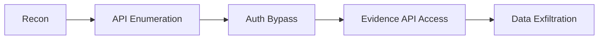
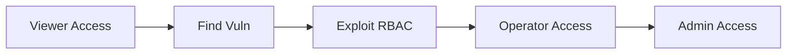

# Penetration Testing Specification

## Overview

This document defines the penetration testing requirements, scope, and procedures for Guardian Shield. Tests are designed to validate security controls and identify vulnerabilities before adversaries can exploit them.

---

## 1. Testing Scope

### 1.1 In-Scope Components

| Component | Test Type | Frequency |
|-----------|-----------|-----------|
| Shield Orchestrator | Application, API | Quarterly |
| Evidence Ledger API | Application, API | Quarterly |
| Regulator Portal | Web Application | Quarterly |
| Alert Pipeline | Infrastructure | Bi-annually |
| Blockchain Anchoring | Smart Contract | Bi-annually |
| Internal Network | Network | Annually |

### 1.2 Out-of-Scope

- Third-party cloud provider infrastructure
- Production data (use synthetic data)
- Denial of Service testing (coordinate separately)
- Social engineering (separate engagement)

---

## 2. Attack Scenarios

### 2.1 External Attacker Scenarios

#### Scenario E1: API Authentication Bypass

**Objective:** Attempt to access protected API endpoints without valid credentials

**Test Cases:**
1. JWT token manipulation (signature bypass, algorithm confusion)
2. Token replay attacks
3. Session fixation
4. mTLS certificate spoofing
5. OAuth flow manipulation

**Expected Controls:**
- Strong JWT validation
- Token binding to client
- Certificate pinning
- Short token expiration

#### Scenario E2: Evidence Tampering

**Objective:** Attempt to modify or delete evidence records

**Test Cases:**
1. Direct database access attempts
2. API parameter manipulation
3. Race condition exploitation
4. Hash collision attacks
5. Timestamp manipulation

**Expected Controls:**
- Append-only data structures
- Cryptographic hash chains
- Blockchain anchoring verification
- Input validation

#### Scenario E3: Privilege Escalation

**Objective:** Escalate from viewer to operator/admin role

**Test Cases:**
1. RBAC bypass attempts
2. Role parameter tampering
3. Horizontal privilege escalation
4. Indirect object reference exploitation
5. Permission inheritance abuse

**Expected Controls:**
- Server-side role enforcement
- Principle of least privilege
- Regular access reviews
- Audit logging

### 2.2 Insider Threat Scenarios

#### Scenario I1: Rogue Operator

**Objective:** Simulate malicious operator attempting unauthorized actions

**Test Cases:**
1. Mass evidence export
2. Configuration tampering
3. Alert suppression
4. Audit log manipulation
5. Backdoor installation

**Expected Controls:**
- Separation of duties
- Multi-party authorization
- Immutable audit logs
- Behavioral analytics

#### Scenario I2: Compromised Service Account

**Objective:** Simulate compromised service account exploitation

**Test Cases:**
1. Lateral movement
2. Secret extraction
3. Privilege escalation
4. Data exfiltration
5. Persistence mechanisms

**Expected Controls:**
- Least privilege service accounts
- Secret rotation
- Network segmentation
- Runtime security monitoring

### 2.3 Quantum-Grade Scenarios

#### Scenario Q1: Cryptographic Attacks

**Objective:** Test resilience against advanced cryptographic attacks

**Test Cases:**
1. Hash collision attempts (SHA-256)
2. Signature forgery attempts (ECDSA)
3. Key extraction via side channels
4. Timing attacks
5. Padding oracle attacks

**Expected Controls:**
- Modern cryptographic algorithms
- Constant-time implementations
- Hardware security modules
- Post-quantum readiness assessment

#### Scenario Q2: Supply Chain Attack

**Objective:** Test defenses against compromised dependencies

**Test Cases:**
1. Malicious dependency injection
2. Container image tampering
3. CI/CD pipeline compromise
4. Signed artifact verification bypass
5. Build reproducibility verification

**Expected Controls:**
- Dependency pinning
- Image signing (Cosign)
- SLSA compliance
- Reproducible builds

---

## 3. Red Team Exercises

### 3.1 Exercise Framework

```yaml
redTeamExercise:
  name: "Operation Shield Break"
  duration: 5 days
  scope: full-stack
  
  objectives:
    - Exfiltrate evidence data
    - Manipulate alert pipeline
    - Achieve persistent access
    - Bypass blockchain verification
    
  rules:
    - No DoS attacks
    - No production data access
    - Document all findings
    - Stop on critical finding
```

### 3.2 Attack Chains

#### Chain 1: External to Evidence Access



#### Chain 2: Insider to Admin



### 3.3 Purple Team Integration

- Real-time collaboration between red and blue teams
- Immediate feedback on detection capabilities
- Joint improvement of security controls
- Detection rule development

---

## 4. Vulnerability Classifications

### 4.1 Severity Matrix

| Severity | CVSS Score | Response Time | Example |
|----------|------------|---------------|---------|
| Critical | 9.0 - 10.0 | 24 hours | RCE, Auth Bypass |
| High | 7.0 - 8.9 | 72 hours | Privilege Escalation |
| Medium | 4.0 - 6.9 | 2 weeks | Info Disclosure |
| Low | 0.1 - 3.9 | 1 month | Minor Issues |

### 4.2 Impact Categories

| Category | Description | Weight |
|----------|-------------|--------|
| Confidentiality | Evidence data exposure | High |
| Integrity | Evidence tampering | Critical |
| Availability | Service disruption | Medium |
| Compliance | Regulatory violation | High |

---

## 5. Testing Tools

### 5.1 Approved Tools

| Tool | Purpose | Version |
|------|---------|---------|
| Burp Suite Pro | Web application testing | Latest |
| Nuclei | Vulnerability scanning | Latest |
| ffuf | Fuzzing | Latest |
| sqlmap | SQL injection | Latest |
| jwt_tool | JWT analysis | Latest |
| Semgrep | SAST | Latest |
| Trivy | Container scanning | Latest |

### 5.2 Custom Tools

```yaml
customTools:
  - name: evidence-fuzzer
    description: Evidence API fuzzing tool
    target: Evidence Ledger API
    
  - name: anchor-verifier
    description: Blockchain anchor verification
    target: BSC Anchors
    
  - name: hash-chain-validator
    description: Hash chain integrity checker
    target: Evidence Records
```

---

## 6. Reporting Requirements

### 6.1 Report Structure

1. **Executive Summary**
   - Overall risk rating
   - Key findings
   - Recommendations

2. **Technical Details**
   - Vulnerability descriptions
   - Reproduction steps
   - Evidence (screenshots, logs)
   - CVSS scores

3. **Remediation Guidance**
   - Fix recommendations
   - Verification steps
   - Timeline suggestions

### 6.2 Finding Template

```markdown
## Finding: [Title]

**Severity:** [Critical/High/Medium/Low]
**CVSS Score:** [X.X]
**Status:** [Open/Fixed/Accepted Risk]

### Description
[Detailed description of the vulnerability]

### Impact
[Business and technical impact]

### Reproduction Steps
1. Step one
2. Step two
3. Step three

### Evidence
[Screenshots, logs, requests/responses]

### Remediation
[Specific fix recommendations]

### References
- [CVE if applicable]
- [OWASP reference]
```

---

## 7. Schedule

### 7.1 Annual Testing Calendar

| Quarter | Focus Area | Type |
|---------|------------|------|
| Q1 | API Security | Pentest |
| Q2 | Web Application | Pentest |
| Q3 | Infrastructure | Pentest + Red Team |
| Q4 | Full Stack | Red Team Exercise |

### 7.2 Continuous Testing

- Weekly automated vulnerability scans
- Monthly SAST/DAST scans
- Bi-weekly dependency audits
- Daily container image scans

---

## 8. Acceptance Criteria

### 8.1 Pass Criteria

- No unmitigated critical or high vulnerabilities
- All authentication mechanisms resist bypass
- Evidence integrity verified under attack
- Alert pipeline functions under stress
- Audit logs capture all security events

### 8.2 Fail Criteria

- Evidence data accessible without authorization
- Evidence records modifiable
- Blockchain verification bypassable
- Admin access achievable from external
- Audit logs tamperable

---

## Appendix A: Rules of Engagement

1. Written authorization required before testing
2. Testing in designated environments only
3. No actions that could impact availability
4. Immediately report critical findings
5. Secure handling of all findings
6. Data handling per data classification policy
7. Debrief within 48 hours of completion

---

**Document Version:** 1.0  
**Last Updated:** {{DATE}}  
**Classification:** Confidential
