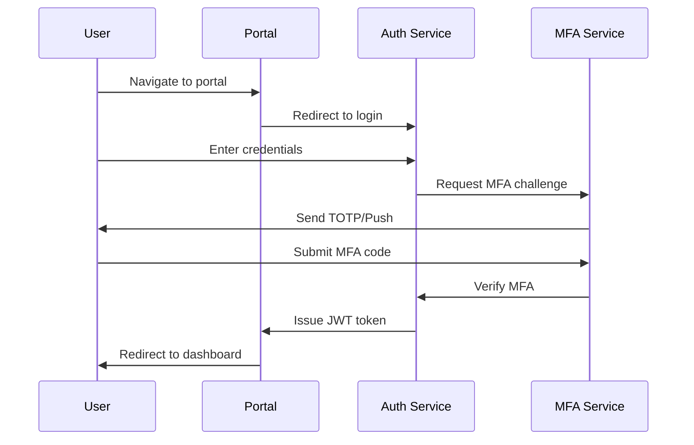

# Guardian Shield — Regulator Portal Specification
## Crypto Hound LLC — Portal UX + Features

---

## 1. Overview

The Guardian Shield Regulator Portal provides authorized regulators, auditors, and investors with a secure web interface to access, verify, and export fraud evidence and compliance reports.

---

## 2. User Roles & Permissions

### 2.1 Role Matrix

| Feature | Regulator | Auditor | Investor | Viewer |
|---------|-----------|---------|----------|--------|
| View Evidence Ledger | ✅ | ✅ | ❌ | ❌ |
| Verify Evidence | ✅ | ✅ | ✅ | ❌ |
| Export Reports | ✅ | ✅ | ❌ | ❌ |
| View Alerts | ✅ | ✅ | ✅ | ✅ |
| View Drills | ✅ | ✅ | ❌ | ❌ |
| Access Dashboards | ✅ | ✅ | ✅ | ✅ |
| Download Bundles | ✅ | ✅ | ❌ | ❌ |
| Audit Logs | ✅ | ✅ | ❌ | ❌ |
| User Profile | ✅ | ✅ | ✅ | ✅ |
| API Keys | ✅ | ✅ | ❌ | ❌ |

### 2.2 Authentication Flow



---

## 3. Portal Features

### 3.1 Evidence Ledger Browser

**Purpose:** Browse and search the append-only evidence ledger.

**Features:**
- Full-text search across case IDs, evidence types, and metadata
- Severity-based filtering (Critical, High, Medium, Watchlist)
- Date range filtering
- Status filtering (Pending, Sealed, Archived, Exported)
- Pagination with configurable page size
- Inline hash verification
- One-click signature validation
- Anchor status indicators

**UI Components:**
```
┌─────────────────────────────────────────────────────────────────┐
│ Evidence Ledger                                     [Export ▼]  │
├─────────────────────────────────────────────────────────────────┤
│ 🔍 Search: [_____________________]  [Filters ▼]  [Date Range]   │
├─────────────────────────────────────────────────────────────────┤
│ Entry ID   │ Case ID          │ Severity │ Type │ Status │ Date │
├────────────┼──────────────────┼──────────┼──────┼────────┼──────┤
│ e7f3...    │ fraud_tx_20e65f  │ 🚨 Crit  │ JSON │ Sealed │ 1/15 │
│ a2b1...    │ fraud_tx_8cb241  │ ⚠️ High  │ PDF  │ Sealed │ 1/14 │
│ c9d4...    │ fraud_tx_3fe892  │ ⚡ Med   │ PNG  │ Pending│ 1/13 │
└────────────┴──────────────────┴──────────┴──────┴────────┴──────┘
│ ◀ Prev  │  Page 1 of 45  │  Next ▶  │  Showing 1-20 of 892     │
└─────────────────────────────────────────────────────────────────┘
```

### 3.2 Evidence Verification

**Purpose:** Verify authenticity and integrity of evidence bundles.

**Features:**
- Drag-and-drop file upload
- Bundle ID lookup
- Hash verification with visual confirmation
- Signature validation with signer details
- Blockchain anchor verification with links
- Verification certificate generation

**UI Components:**
```
┌─────────────────────────────────────────────────────────────────┐
│ Evidence Verification                                           │
├─────────────────────────────────────────────────────────────────┤
│ ┌─────────────────────────────────────────────────────────────┐ │
│ │                                                             │ │
│ │       📁 Drag & drop evidence bundle here                   │ │
│ │              or enter Bundle ID below                       │ │
│ │                                                             │ │
│ └─────────────────────────────────────────────────────────────┘ │
│                                                                 │
│ Bundle ID: [_________________________________] [Verify]         │
├─────────────────────────────────────────────────────────────────┤
│ Verification Results                                            │
│ ──────────────────                                              │
│ ✅ Hash Valid:       SHA-256 matches ledger record              │
│ ✅ Signature Valid:  Signed by Crypto Hound LLC (verified)      │
│ ✅ Anchor Confirmed: Bitcoin tx 3a7f... (142 confirmations)     │
│                                                                 │
│ [Download Verification Certificate]                             │
└─────────────────────────────────────────────────────────────────┘
```

### 3.3 Reports Dashboard

**Purpose:** Access and download incident reports and compliance bundles.

**Features:**
- Weekly incident reports list
- Drill reports list
- Compliance bundle export
- Report preview
- PDF/A download with signature
- Historical report archive

**Report Types:**
| Type | Frequency | Contents |
|------|-----------|----------|
| Weekly Incident | Monday | All alerts, SLA metrics, drill results |
| Monthly Summary | 1st of month | Aggregated metrics, trends |
| Compliance Bundle | On-demand | Full evidence package |
| Drill Report | Per drill | Drill results, response times |

### 3.4 Synthetic Drill Monitor

**Purpose:** View synthetic drill execution and results.

**Features:**
- Drill schedule calendar
- Real-time drill status
- Historical drill results
- SLA compliance tracking
- Drill failure alerts

**Drill Scenarios:**
| Scenario | Frequency | Severity | SLA Target |
|----------|-----------|----------|------------|
| Mixer Interaction | Weekly | Critical | 5 minutes |
| Exchange Sweep | Daily | High | 15 minutes |
| Mining Pool Batch | Bi-weekly | Medium | 60 minutes |
| Dust Output Move | Monthly | Watchlist | 24 hours |

### 3.5 Alerts Feed

**Purpose:** Real-time alert stream with routing indicators.

**Features:**
- Live alert stream (WebSocket)
- Severity-based filtering
- Alert detail expansion
- Routing indicator badges
- Alert acknowledgment
- Escalation history

**Alert Card Layout:**
```
┌─────────────────────────────────────────────────────────────────┐
│ 🚨 CRITICAL │ fraud_tx_20e65feb │ 2025-01-15 10:30:22 UTC      │
├─────────────────────────────────────────────────────────────────┤
│ Mixer Interaction Detected                                      │
│                                                                 │
│ Fraud-linked cluster interacted with mixer/coinjoin service.    │
│ Cluster: tornado-cash-like                                      │
│ Value: 15.7 BTC                                                 │
│                                                                 │
│ Routing: [✅ Regulator] [✅ Investor] [✅ Dashboard]            │
│                                                                 │
│ [View Evidence] [View Lineage Graph] [Acknowledge]              │
└─────────────────────────────────────────────────────────────────┘
```

### 3.6 Audit Log Viewer

**Purpose:** View immutable audit trail of all portal activities.

**Features:**
- Chronological activity log
- User-based filtering
- Action type filtering
- Export audit trail
- Tamper-evident verification

**Logged Actions:**
- Login/logout events
- Evidence access
- Report downloads
- Verification requests
- Configuration changes

### 3.7 User Profile

**Purpose:** Allow users to manage their profile information, security settings, and preferences.

**Features:**
- View and edit profile information (name, email, contact info)
- Upload and change profile photo
- Manage security settings:
  - Enable/disable two-factor authentication
  - View and revoke active sessions
  - Create and manage API keys
- Configure notification preferences:
  - Email notifications (alerts, reports, drills)
  - In-app notifications
  - Delivery preferences (digest, quiet hours)
- View activity log:
  - Profile updates
  - Login events
  - API operations
  - Evidence access history

**Profile Information Card:**
```
┌───────────────────────────────────────────┐
│ Profile Information                       │
├───────────────────────────────────────────┤
│        ┌─────────┐                        │
│        │ [Photo] │                        │
│        └─────────┘                        │
│      [Change Photo]                       │
│                                           │
│ Name: John Doe                            │
│ Email: john.doe@regulator.gov             │
│ Role: Regulator                           │
│ Organization: SEC                         │
│ Member Since: Jan 15, 2025                │
│                                           │
│              [Edit Profile]               │
└───────────────────────────────────────────┘
```

**Security Settings Card:**
```
┌───────────────────────────────────────────┐
│ Security Settings                         │
├───────────────────────────────────────────┤
│ Two-Factor Authentication                 │
│ ✓ Enabled (TOTP)                          │
│ Last used: 3 hours ago                    │
│ [Manage 2FA]                              │
├───────────────────────────────────────────┤
│ Active Sessions: 1                        │
│ Current: Chrome on Windows                │
│ [View All Sessions]                       │
├───────────────────────────────────────────┤
│ API Keys: 2 active                        │
│ [Manage API Keys]                         │
└───────────────────────────────────────────┘
```

**User Menu (Header Dropdown):**
- Profile - Navigate to profile page
- Settings - Quick access to preferences
- Activity - View recent activity
- API Keys - Manage API credentials
- Help & Support - Access help center
- Documentation - View documentation
- Logout - Sign out of portal

---

## 4. UI/UX Guidelines

### 4.1 Design System

**Color Palette:**
| Color | Hex | Usage |
|-------|-----|-------|
| Primary Blue | #1976D2 | Primary actions, links |
| Critical Red | #C62828 | Critical severity |
| High Orange | #FF9800 | High severity |
| Medium Yellow | #FFC107 | Medium severity |
| Watchlist Blue | #2196F3 | Watchlist severity |
| Success Green | #4CAF50 | Success states |
| Background | #FAFAFA | Page background |
| Surface | #FFFFFF | Card background |
| Text Primary | #212121 | Primary text |
| Text Secondary | #757575 | Secondary text |

**Typography:**
| Element | Font | Size | Weight |
|---------|------|------|--------|
| H1 | Inter | 32px | 700 |
| H2 | Inter | 24px | 600 |
| H3 | Inter | 20px | 600 |
| Body | Inter | 16px | 400 |
| Caption | Inter | 14px | 400 |
| Monospace | JetBrains Mono | 14px | 400 |

### 4.2 Responsive Breakpoints

| Breakpoint | Width | Layout |
|------------|-------|--------|
| Mobile | < 768px | Single column |
| Tablet | 768-1024px | Two column |
| Desktop | > 1024px | Full layout |

### 4.3 Accessibility

- WCAG 2.1 AA compliance
- Keyboard navigation support
- Screen reader compatibility
- High contrast mode
- Focus indicators
- Skip navigation links

---

## 5. Security Features

### 5.1 Session Management

```yaml
session:
  timeout: 60m  # 30m for admin roles
  refresh: true
  concurrent_limit: 1  # Single session per user
  bind_to_ip: true
  secure_cookie: true
  httponly: true
  samesite: strict
```

### 5.2 Rate Limiting

| Endpoint | Limit | Window |
|----------|-------|--------|
| Login | 5 attempts | 15 minutes |
| API calls | 100 requests | 1 minute |
| Exports | 10 requests | 1 hour |
| Verification | 50 requests | 1 minute |

### 5.3 Audit Trail

All actions are logged with:
- Timestamp (UTC)
- User ID
- Action type
- Target resource
- IP address
- User agent
- Result (success/failure)

---

## 6. Performance Requirements

| Metric | Target |
|--------|--------|
| Page Load Time | < 2 seconds |
| Time to Interactive | < 3 seconds |
| API Response Time | < 500ms (p95) |
| Search Response Time | < 1 second |
| Report Generation | < 30 seconds |
| Lighthouse Score | > 90 |

---

## 7. Browser Support

| Browser | Minimum Version |
|---------|-----------------|
| Chrome | 90+ |
| Firefox | 88+ |
| Safari | 14+ |
| Edge | 90+ |

---

*© 2025 Crypto Hound LLC. All rights reserved.*
