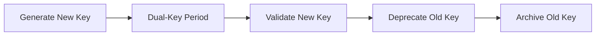

# Security Hardening Specification

## Overview

This document specifies security hardening requirements for Guardian Shield deployment, covering authentication, authorization, encryption, and infrastructure security.

---

## 1. Authentication

### 1.1 Identity Providers

| Component | Auth Method | Provider |
|-----------|-------------|----------|
| Operator Console | OIDC | Keycloak/Auth0 |
| API Access | mTLS + JWT | Internal PKI |
| Service-to-Service | mTLS | SPIFFE/SPIRE |
| Regulator Portal | SAML 2.0 | Customer IdP |

### 1.2 Multi-Factor Authentication

- **Required for:** All human operators
- **Methods:** TOTP, WebAuthn, Hardware tokens
- **Backup:** Emergency access codes (audited)

### 1.3 Service Account Management

```yaml
serviceAccounts:
  - name: shield-orchestrator
    scope: cluster
    secretRotation: 24h
    permissions: limited
    
  - name: evidence-writer
    scope: namespace
    secretRotation: 12h
    permissions: evidence-append-only
```

---

## 2. Role-Based Access Control (RBAC)

### 2.1 Role Definitions

| Role | Description | Permissions |
|------|-------------|-------------|
| `super-admin` | Emergency access only | All permissions |
| `security-admin` | Security configuration | RBAC, keys, audit |
| `operator` | Day-to-day operations | Read, execute, configure |
| `auditor` | Read-only verification | Read, verify, export |
| `viewer` | Dashboard access | Read metrics only |

### 2.2 Permission Matrix

```yaml
permissions:
  evidence:
    - read
    - append
    - verify
    - export
  alerts:
    - read
    - acknowledge
    - configure
  config:
    - read
    - update
  drills:
    - read
    - execute
    - configure
```

### 2.3 Principle of Least Privilege

- All service accounts start with zero permissions
- Permissions explicitly granted via policy
- Regular access reviews (quarterly)
- Automatic permission expiration for temporary access

---

## 3. Encryption

### 3.1 Encryption at Rest

| Data Type | Algorithm | Key Size | Key Rotation |
|-----------|-----------|----------|--------------|
| Evidence Records | AES-256-GCM | 256-bit | 90 days |
| Configuration | AES-256-GCM | 256-bit | 90 days |
| Logs | AES-256-GCM | 256-bit | 90 days |
| Backups | AES-256-GCM | 256-bit | 30 days |

### 3.2 Encryption in Transit

```yaml
tls:
  minVersion: TLS1.3
  cipherSuites:
    - TLS_AES_256_GCM_SHA384
    - TLS_CHACHA20_POLY1305_SHA256
  certificateRotation: 30d
  mtls:
    enabled: true
    clientVerification: required
```

### 3.3 Key Management

- **KMS Provider:** HashiCorp Vault / AWS KMS / GCP KMS
- **Key Hierarchy:**
  - Master Key (HSM-protected)
  - Data Encryption Keys (DEKs)
  - Key Encryption Keys (KEKs)
- **Key Rotation:** Automated, no-downtime rotation

---

## 4. Key Rotation

### 4.1 Rotation Schedule

| Key Type | Rotation Interval | Method |
|----------|-------------------|--------|
| Service TLS | 30 days | Automatic |
| API Signing | 90 days | Automatic |
| Evidence Signing | 90 days | Manual approval |
| Master Keys | 365 days | HSM ceremony |

### 4.2 Rotation Process



### 4.3 Emergency Key Revocation

- Immediate revocation capability
- Requires dual authorization
- Automatic service restart with new keys
- Audit log of all revocations

---

## 5. Infrastructure Security

### 5.1 Network Segmentation

```yaml
networkPolicies:
  - name: deny-all-default
    podSelector: {}
    policyTypes: [Ingress, Egress]
    
  - name: allow-orchestrator-to-agents
    podSelector:
      matchLabels:
        app: shield-orchestrator
    egress:
      - to:
          - podSelector:
              matchLabels:
                type: agent
```

### 5.2 Pod Security Standards

```yaml
podSecurityStandards:
  enforce: restricted
  warn: restricted
  audit: restricted
  
securityContext:
  runAsNonRoot: true
  readOnlyRootFilesystem: true
  allowPrivilegeEscalation: false
  capabilities:
    drop: [ALL]
```

### 5.3 Container Image Security

- Base images: Distroless or Alpine
- Image signing: Cosign/Notary
- Vulnerability scanning: Trivy/Grype
- No root processes
- Immutable containers

### 5.4 Secret Management

```yaml
secrets:
  provider: vault
  injection: sidecar
  rotation: automatic
  
  paths:
    - path: secret/data/shield/tls
      key: cert
    - path: secret/data/shield/signing
      key: private_key
```

---

## 6. Audit Logging

### 6.1 Log Requirements

| Event Type | Retention | Format |
|------------|-----------|--------|
| Authentication | 2 years | JSON |
| Authorization | 2 years | JSON |
| Data Access | 7 years | JSON |
| Configuration Changes | 7 years | JSON |
| Security Events | 7 years | JSON |

### 6.2 Log Integrity

- Cryptographic signing of log batches
- Hash chaining between batches
- Immutable storage (S3 Object Lock / GCS Retention)
- Regular integrity verification

### 6.3 Log Contents

```json
{
  "timestamp": "2025-01-15T10:30:00Z",
  "eventType": "data_access",
  "actor": {
    "type": "user",
    "id": "user-123",
    "ip": "10.0.1.50"
  },
  "resource": {
    "type": "evidence",
    "id": "ev-456"
  },
  "action": "read",
  "result": "success",
  "metadata": {}
}
```

---

## 7. Compliance Controls

### 7.1 Control Framework Mapping

| Control | SOC 2 | ISO 27001 | PCI DSS |
|---------|-------|-----------|---------|
| Access Control | CC6.1 | A.9 | 7.1 |
| Encryption | CC6.7 | A.10 | 3.4 |
| Logging | CC7.2 | A.12.4 | 10.2 |
| Key Management | CC6.6 | A.10.1 | 3.5 |

### 7.2 Automated Compliance Checks

```yaml
complianceChecks:
  - name: encryption-at-rest
    schedule: "0 * * * *"
    threshold: 100%
    
  - name: access-review
    schedule: "0 0 * * 0"
    threshold: 100%
    
  - name: vulnerability-scan
    schedule: "0 2 * * *"
    threshold: 0 critical
```

---

## 8. Incident Response

### 8.1 Security Incident Categories

| Category | Severity | Response Time |
|----------|----------|---------------|
| Data Breach | Critical | 15 minutes |
| Unauthorized Access | High | 30 minutes |
| Policy Violation | Medium | 2 hours |
| Anomaly Detection | Low | 24 hours |

### 8.2 Automated Response Actions

```yaml
automatedResponses:
  - trigger: unauthorized_access_attempt
    actions:
      - block_ip
      - revoke_session
      - alert_security_team
      
  - trigger: data_exfiltration_detected
    actions:
      - isolate_pod
      - capture_forensics
      - alert_incident_response
```

---

## Appendix A: Security Checklist

- [ ] mTLS enabled for all service communication
- [ ] All secrets stored in Vault
- [ ] Network policies deny-by-default
- [ ] Pod security standards enforced
- [ ] Images signed and verified
- [ ] Audit logging enabled
- [ ] Key rotation automated
- [ ] Vulnerability scanning in CI/CD
- [ ] Penetration testing scheduled
- [ ] Incident response playbooks tested

---

**Document Version:** 1.0  
**Last Updated:** {{DATE}}  
**Classification:** Internal / Confidential
