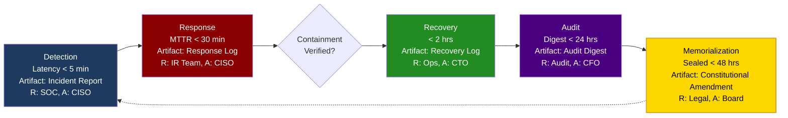

# Sovereign Constitutional Artifact

## Crypto Hound LLC — Governance Drill Cycle

> **Preamble:** "Let this drill cycle be memorialized as law, binding resilience to governance."

## Incident Response Lifecycle

The following flowchart documents the sovereign incident response process, establishing binding governance for detection, response, recovery, audit, and memorialization phases.

## Phase Specifications

### 1. Detection Phase

| Attribute | Value |
|-----------|-------|
| **SLA Target** | < 5 minutes |
| **Artifact** | Incident Report |
| **Responsible** | Security Operations Center (SOC) |
| **Accountable** | Chief Information Security Officer (CISO) |

### 2. Response Phase

| Attribute | Value |
|-----------|-------|
| **SLA Target** | MTTR < 30 minutes |
| **Artifact** | Response Log |
| **Responsible** | Incident Response (IR) Team |
| **Accountable** | Chief Information Security Officer (CISO) |

### 3. Containment Verification

| Attribute | Value |
|-----------|-------|
| **Decision Point** | Binary verification gate |
| **Criteria** | Threat isolated, no lateral movement |
| **Escalation** | Return to Response if not verified |

### 4. Recovery Phase

| Attribute | Value |
|-----------|-------|
| **SLA Target** | < 2 hours |
| **Artifact** | Recovery Log |
| **Responsible** | Operations Team (Ops) |
| **Accountable** | Chief Technology Officer (CTO) |

### 5. Audit Phase

| Attribute | Value |
|-----------|-------|
| **SLA Target** | Digest < 24 hours |
| **Artifact** | Audit Digest |
| **Responsible** | Audit Team |
| **Accountable** | Chief Financial Officer (CFO) |

### 6. Memorialization Phase

| Attribute | Value |
|-----------|-------|
| **SLA Target** | Sealed < 48 hours |
| **Artifact** | Constitutional Amendment |
| **Responsible** | Legal Team |
| **Accountable** | Board of Directors |

## Governance Binding

This artifact shall be sealed within the sovereign archive as enduring testament to the incident response governance framework. The continuous cycle from Memorialization back to Detection ensures perpetual improvement and regulatory compliance.

## Compliance Requirements

- All artifacts must be hash-signed using SHA-256
- Evidence must be anchored to at least one blockchain network
- Audit digests must be regulator-verifiable
- Constitutional amendments require Board approval

---

**Footer:** "Sealed and archived under Crypto Hound LLC governance, November 2025."

**Copyright © 2025 Crypto Hound LLC. All rights reserved.**
